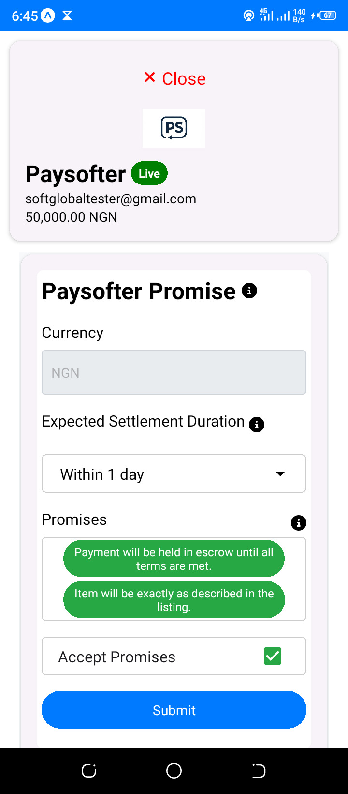
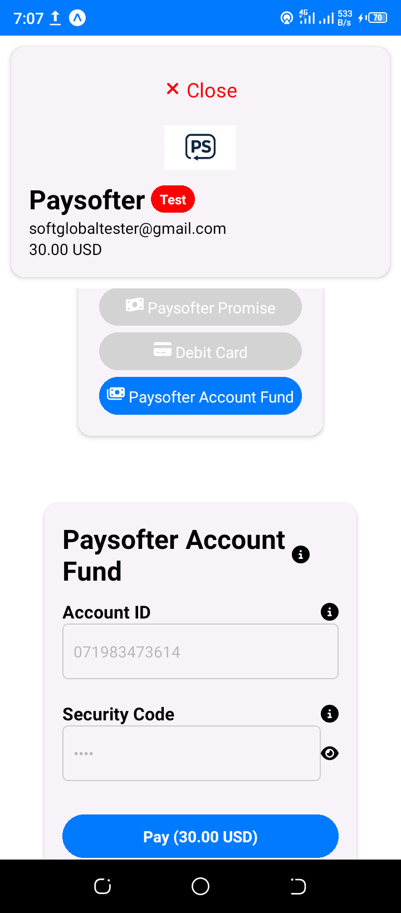

<!-- README.md -->

# React Native Paysofter

This is a React Native package for integrating Paysofter payment gateway into your React Native andriod and iOS applications.



## Installation

To install the package, run:

```bash
npm install react-native-paysofter
```

## Usage

Here are basic examples of how to use the `react-native-paysofter` library in your React Native project.



### Example 1: Basic Payment Setup

```jsx
import React from "react";
import { Paysofter } from "react-native-paysofter";

const App = () => {
  const amount = 100; // Amount in USD, e.g., 100 USD
  const paysofterPublicKey = "test_api_key_abc123"; // Replace with your actual Paysofter public key
  const promises = [
    "Payment will be held in escrow until all terms are met.",
    "Item will be exactly as described in the listing.",
    "Item will be delivered within the agreed timeframe.",
    "Refund will be given if seller doesn't meet terms.",
  ];

  const handleSuccess = () => {
    console.log("Payment successful!");
  };

  const handleClose = () => {
    console.log("Payment window closed.");
  };

  return (
    <Paysofter
      amount={amount}
      currency="USD"
      email="user@example.com"
      paysofterPublicKey={paysofterPublicKey}
      onSuccess={handleSuccess}
      onClose={handleClose}
      referenceId={`RID${Math.floor(Math.random() * 10000000000000000)}`}
      showPromiseOption={true}
      showFundOption={false}
      showCardOption={true}
      promises={promises}
    />
  );
};

export default App;
```

### Example 2: Payment Setup with "Pay Now" Button Option

```jsx
import React, { useState } from "react";
import { View, Button } from "react-native";
import { Paysofter } from "react-native-paysofter";

const App = () => {
  const [showPayment, setShowPayment] = useState(false);
  const amount = 5000; // Amount in Nigerian Naira, e.g., NGN 5,000
  const currency = "NGN"; // Nigerian Naira
  const email = "buyer@example.com"; // Buyer's email
  const paysofterPublicKey = "test_api_key_abc123"; // Replace with your actual Paysofter public key
  const promises = [
    "Payment will be held in escrow until all terms are met.",
    "Item will be exactly as described in the listing.",
    "Item will be delivered within the agreed timeframe.",
    "Refund will be given if seller doesn't meet terms.",
  ];

  const handleSuccess = () => {
    console.log("Payment successful!");
    setShowPayment(false); // Hide payment component after success
  };

  const handleClose = () => {
    console.log("Payment window closed.");
    setShowPayment(false); // Hide payment component when closed
  };

  return (
    <View style={{ flex: 1, justifyContent: "center", alignItems: "center" }}>
      {!showPayment ? (
        <Button title="Pay Now" onPress={() => setShowPayment(true)} />
      ) : (
        <Paysofter
          amount={amount}
          currency={currency}
          email={email}
          paysofterPublicKey={paysofterPublicKey}
          onSuccess={handleSuccess}
          onClose={handleClose}
          referenceId={`RID${Math.floor(Math.random() * 10000000000000000)}`}
          showPromiseOption={true}
          showFundOption={false}
          showCardOption={false}
          promises={promises}
        />
      )}
    </View>
  );
};

export default App;
```

### Example 3: Payment Setup with "Pay Now" Button Option and Input Fields

```jsx
import React, { useState } from "react";
import {
  SafeAreaView,
  ScrollView,
  View,
  Button,
  TextInput,
  StyleSheet,
  Text,
} from "react-native";
import { Paysofter } from "react-native-paysofter";

const App = () => {
  const [showPayment, setShowPayment] = useState(false);
  const [amount, setAmount] = useState(5000); // Default amount
  const [currency, setCurrency] = useState("NGN"); // Default currency
  const [email, setEmail] = useState("buyer@example.com"); // Default email
  const [paysofterPublicKey] = useState("test_api_key_abc123"); // Replace with your actual Paysofter public key
  // const referenceId = `RID${Math.floor(Math.random() * 10000000000000000)}`; // Generate a 17-digit random payment reference with RID prefix
  const referenceId = `RID${new Date()
    .toISOString()
    .slice(2, 19)
    .replace(/[-T:]/g, "")}${Math.floor(Math.random() * 100000)}`; // Or generate a 17-digit payment reference with RID prefix starting with the timestamp and random numbers appended at the end.
  console.log("referenceId:", referenceId);
  const promises = [
    "Payment will be held in escrow until all terms are met.",
    "Item will be exactly as described in the listing.",
    "Item will be delivered within the agreed timeframe.",
    "Refund will be given if seller doesn't meet terms.",
  ];

  const handleSuccess = () => {
    console.log("Payment successful!");
    setShowPayment(false); // Hide payment component after success
  };

  const handleClose = () => {
    console.log("Payment window closed.");
    setShowPayment(false); // Hide payment component when closed
  };

  return (
    <SafeAreaView style={styles.safeArea}>
      <ScrollView contentContainerStyle={styles.scrollView}>
        <View style={styles.container}>
          <Text style={styles.title}>Checkout</Text>
          {!showPayment ? (
            <>
              <TextInput
                style={styles.input}
                placeholder="Enter Amount"
                keyboardType="numeric"
                value={amount.toString()}
                onChangeText={(text) => setAmount(Number(text))}
              />
              <TextInput
                style={styles.input}
                placeholder="Enter Currency"
                value={currency}
                onChangeText={(text) => setCurrency(text)}
              />
              <TextInput
                style={styles.input}
                placeholder="Enter Email"
                keyboardType="email-address"
                value={email}
                onChangeText={(text) => setEmail(text)}
              />
              <Button title="Pay Now" onPress={() => setShowPayment(true)} />
            </>
          ) : (
            <Paysofter
              amount={amount}
              currency={currency}
              email={email}
              paysofterPublicKey={paysofterPublicKey}
              onSuccess={handleSuccess}
              onClose={handleClose}
              referenceId={referenceId}
              showPromiseOption={true}
              showFundOption={true}
              showCardOption={true}
              promises={promises}
            />
          )}
        </View>
      </ScrollView>
    </SafeAreaView>
  );
};

const styles = StyleSheet.create({
  safeArea: {
    flex: 1,
    backgroundColor: "#fff",
  },
  scrollView: {
    flexGrow: 1,
    justifyContent: "center",
    alignItems: "center",
    padding: 20,
  },
  container: {
    justifyContent: "center",
    alignItems: "center",
    width: "100%",
  },
  title: {
    fontSize: 24,
    fontWeight: "bold",
    textAlign: "center",
    padding: 20,
  },
  input: {
    height: 40,
    borderColor: "#ccc",
    borderWidth: 1,
    borderRadius: 5,
    marginBottom: 10,
    paddingHorizontal: 10,
    width: "80%",
  },
});

export default App;
```


## Props

| Prop Name            | Type                  | Description                                                                                                                                                                                                                                                                                                                                                                     |
|----------------------|-----------------------|---------------------------------------------------------------------------------------------------------------------------------------------------------------------------------------------------------------------------------------------------------------------------------------------------------------------------------------------------------------------------------|
| `amount`             | Number                | The amount to be paid.                                                                                                                                                                                                                                                                                                                                                          |
| `currency`           | String                | The currency in which the payment is to be made (e.g., USD, NGN).                                                                                                                                                                                                                                                                                                               |
| `email`              | String                | The email address of the user making the payment.                                                                                                                                                                                                                                                                                                                               |
| `paysofterPublicKey` | String                | Your Paysofter public key for processing the payment.                                                                                                                                                                                                                                                                                                                           |
| `onSuccess`          | Function              | Callback function to handle the success of the payment.                                                                                                                                                                                                                                                                                                                         |
| `onClose`            | Function              | Callback function to handle the closing of the payment window.                                                                                                                                                                                                                                                                                                                  |
| `showPromiseOption`  | Boolean               | Whether to show the Promise payment option (default: true). If all options are declared false, then Promise payment option defaults to true.                                                                                                                                                                                                                                    |
| `showFundOption`     | Boolean               | Whether to show the Fund Account payment option.                                                                                                                                                                                                                                                                                                                                |
| `showCardOption`     | Boolean               | Whether to show the Card payment option.                                                                                                                                                                                                                                                                                                                                        |
| `buyerName`          | String                | The buyer's name for the Card payment option. This information is optional with a maximum length of 225 characters, and the buyer may choose not to provide it.                                                                                                                                                                                                                 |
| `buyerPhoneNumber`   | String                | The buyer's phone number for the Card payment option. This information is optional, and the buyer may choose not to provide it.                                                                                                                                                                                                                                                 |
| `referenceId`        | String                | A unique identifier for the payment serving as a reference for the payment options. Either generate a 17-digit random payment reference with `RID` prefix, or generate a 17-digit payment reference with `RID` prefix starting with a timestamp and a small random number appended at the end. Paysofter also generates a transaction ID (`TID`) for every transaction. |
| `qty`                | Number                | The quantity or number of units paid for in the transaction. This is optional and ranges from 1 to 10,000 units.                                                                                                                                                                                                                                                                |
| `productName`        | String                | The name of the product being purchased in the transaction. This is optional with a maximum length of 225 characters.                                                                                                                                                                                                                                                           |
| `promises`           | Array or JSON string  | A list of promise strings defining the escrow agreement between buyer and seller. The following defaults must be included: “Item will be exactly as described in the listing.” and “Payment will be held in escrow until all terms are met.” Each promise should be a maximum of 70 characters, and there can be up to 5 promises. If using FormData, stringify the array like so: `formData.append("promises", JSON.stringify(promises));` |


## Contributing to the Project

1. **Fork the Repository:** Begin by forking the repository to your GitHub account.
2. **Create a New Feature Branch:** Create a branch for your feature or bug fix using the following command:
   ```bash
   git checkout -b feature-name
   ```
3. **Commit Your Changes:** Once you’ve made your changes, commit them with a meaningful message:
   ```bash
   git commit -am 'Description of the changes made'
   ```
4. **Push to the Branch:** Push your feature branch to the repository:
   ```bash
   git push origin feature-name
   ```
5. **Submit a Pull Request:** Finally, submit a pull request for review and integration.

## Additional Configuration Options

For further configuration options, please refer to the [Paysofter Documentation](https://paysofter.com/docs/).
